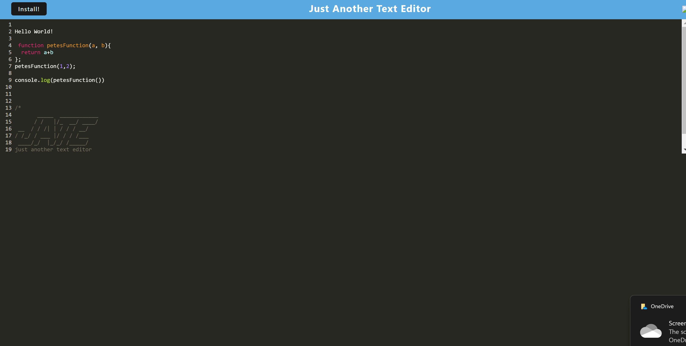

# Text Editor

A Progessive Web Application(PWA) that allows the user to edit and write text online and offline.

By Peter O'Callaghan. A PWA using Node, Express, and webpack.

## Table of Contents 
* [Technologies Used](#technologies-used)
* [Screenshot](#screenshot)
* [Website](#website)
* [Walkthrough Video](#walkthrough-video)
* [Room for Improvement](#room-for-improvement)
* [Acknowledgements](#acknowledgements)

## Technologies Used
* > Javascript
* > HTML
* > CSS
* > Node.js
* > Express.js
* > Webpack
* > Weebpack-Cli

## Screenshot
> 
## Website
[Text Editor](https://text-editor-pocall.herokuapp.com/)
## Walkthrough Video
[Video](https://www.youtube.com/watch?v=h5a_oi2hZPg)
## Room for Improvement
There is a couple features I struggled with. Such as working offline. Hopefully it is fixed by the time this is graded
## Acknowledgements
Monash Bootcamp

